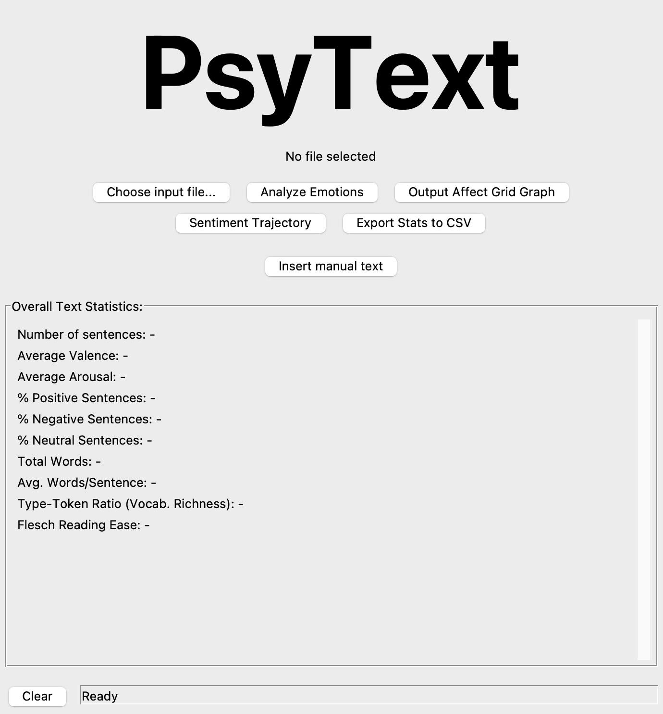

# PsyText - Análise Psicológica de Texto



PsyText é uma aplicação desktop desenvolvida em Python para análise de sentimento e extração de métricas textuais de textos em português. Permite aos utilizadores carregar ficheiros de texto ou inserir texto manualmente para obter relatórios detalhados, incluindo visualizações HTML de frases coloridas por sentimento, gráficos de Affect Grid e Trajetória de Sentimento, e exportação de dados para JSON e CSV.

## Funcionalidades

-   **Análise de Sentimento:** Utiliza o algoritmo VADER (Valence Aware Dictionary and sEntiment Reasoner) do NLTK para determinar a polaridade (positiva, negativa, neutra) e intensidade (compound score) do sentimento de cada frase.
-   **Métricas Textuais:** Calcula descritores como contagem total de palavras, média de palavras por frase, Rácio Tipo-Token (TTR) para riqueza vocabular, e o Índice de Facilidade de Leitura de Flesch.
-   **Contagem de Palavras de Emoção e Pronomes:** Identifica e quantifica a ocorrência de palavras associadas a emoções (alegria, tristeza, raiva, medo, surpresa) e diferentes categorias de pronomes (primeira pessoa, segunda pessoa, etc.).
-   **Relatório HTML Interativo:** Gera um ficheiro HTML onde cada frase do texto original é colorida de acordo com o seu sentimento, acompanhado de uma tabela com estatísticas gerais e descritores textuais.
-   **Visualizações Gráficas:**
    -   **Affect Grid:** Um gráfico de dispersão que mapeia a valência (sentimento) e o arousal (intensidade emocional) de cada frase.
    -   **Trajetória de Sentimento:** Um gráfico de linha que ilustra a evolução do sentimento (valência) ao longo das frases do texto.
-   **Exportação de Dados:** Permite exportar os dados detalhados da análise de cada frase para um ficheiro JSON e as estatísticas agregadas para um ficheiro CSV.
-   **Interface Gráfica do Utilizador (GUI):** Uma interface intuitiva baseada em Tkinter que facilita a interação do utilizador, a seleção de ficheiros, a inserção manual de texto e a visualização dos resultados.

## Tecnologias Utilizadas

-   **Python 3.x:** Linguagem de programação principal.
-   **NLTK (Natural Language Toolkit):** Para tokenização de texto e análise de sentimento (VADER).
-   **Textstat:** Para cálculo de métricas de legibilidade.
-   **Matplotlib:** Para a geração dos gráficos Affect Grid e Trajetória de Sentimento.
-   **Pandas:** Para manipulação e organização de dados, especialmente para a preparação dos gráficos.
-   **Jinja2:** Para a criação dinâmica do relatório HTML a partir de um template.
-   **Tkinter:** Para o desenvolvimento da interface gráfica do utilizador.
-   **Pillow (PIL Fork):** Para o manuseamento e exibição de imagens na GUI.

## Instalação

1.  **Clone o repositório:**
    ```bash
    git clone https://github.com/solraakz/PsyText
    cd psytext
    ```
2.  **Crie e ative um ambiente virtual (recomendado):**
    ```bash
    python3 -m venv venv
    source venv/bin/activate
    # venv\Scripts\activate   # caso seja no Windows, apenas via PowerShell
    ```
3.  **Instale as dependências:**
    ```bash
    pip install -r requirements.txt
    ```

## Utilização

1.  **Execute a aplicação:**
    ```bash
    python interface.py
    ```
2.  **Na Interface Gráfica:**
    *   Clique em "Escolher ficheiro..." para selecionar um ficheiro `.txt` para análise.
    *   Alternativamente, clique em "Inserir texto manual" para digitar ou colar texto diretamente.
    *   Clique em "Analyze Emotions" para iniciar a análise e gerar o relatório HTML. Será perguntado se deseja abrir o HTML no navegador.
    *   Clique em "Output Affect Grid Graph" para visualizar o gráfico Affect Grid.
    *   Clique em "Sentiment Trajectory" para ver a evolução do sentimento.
    *   Clique em "Export Stats to CSV" para guardar as estatísticas gerais num ficheiro CSV.
    *   Todos os ficheiros de saída (HTML, gráficos, JSON, CSV) serão guardados na pasta `output/` dentro do diretório do projeto.
    *   Use o botão "Limpar" para redefinir a interface.